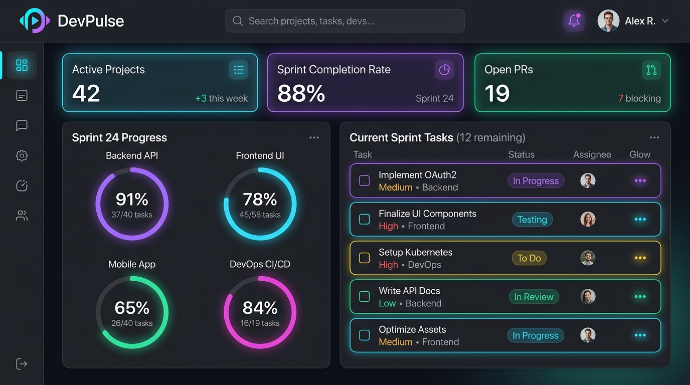
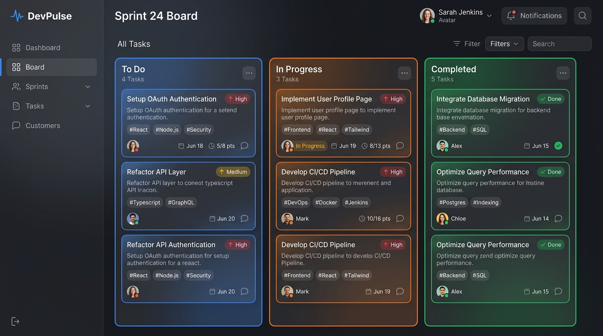

<div align="center">

# ⚡ DevPulse — Developer Productivity Dashboard

**A high-performance, real-time command center for engineering leads and full-stack developers to monitor active repositories, track sprint tasks, manage backlog priorities, and visualize delivery velocity.**

[](https://developer-productivity-dashboard.vercel.app)
[](https://github.com/Akashhh8826/developer-productivity-dashboard)
[](https://nextjs.org/)
[](https://www.typescriptlang.org/)
[](https://tailwindcss.com/)

[**Explore Live Application 🚀**](https://developer-productivity-dashboard.vercel.app) · [**Report Bug 🐞**](https://github.com/Akashhh8826/developer-productivity-dashboard/issues) · [**Request Feature 💡**](https://github.com/Akashhh8826/developer-productivity-dashboard/issues)

</div>

---

## 📸 Visual Previews

### 📊 Executive Overview Dashboard
> Real-time sprint progress ring charts, KPI metrics, dynamic greeting banner, and active sprint tasks.



### 📋 Interactive Sprint & Kanban Board
> Three-column drag & filterable Kanban view with priority badges, assignee avatars, and immediate status synchronization.



---

## 🌟 Key Features

### 1. 📊 Real-Time Metric & Health Monitoring
- **Executive KPIs**: Live count of **Active Projects**, **Tasks Due Today**, **Sprint Completion Rate (%)**, and **Overdue Tickets** with trend badges.
- **Dynamic Circular Progress Rings**: Interactive SVG/CSS circular health rings calculating overall velocity and project breakdown percentages in real-time.
- **Sprint Greeting Banner**: Contextual greeting banner displaying active date, current sprint sprint summaries, and instant status pills.

### 2. 📁 Full-Stack Projects Management (`/projects`)
- **6 Realistic Full-Stack Repositories**: Seeded with authentic industry tech stacks (Node.js, Express, React, Next.js, PostgreSQL, Docker, Redis, Socket.io, Prisma, Firebase, GraphQL, Argon2).
- **Multi-Factor Search & Filtering**: Instant search across titles, descriptions, and tech stacks combined with multi-criteria status/stack dropdowns (**AND logic**).
- **Interactive Project Cards**: Color-coded progress indicators (<30% red, 30–70% amber, >70% emerald), task counts, due dates, and status badges.
- **Deep-Dive Project Modal**: Click any project to inspect full architectural metadata, tech stack tags, and linked sprint tasks with inline status toggles.

### 3. ✅ Sprint Backlog & Kanban (`/tasks`)
- **36+ Linked Engineering Tasks**: Distributed across features, bug fixes, DevOps pipelines, and API integrations.
- **Dual View Modes**: Seamless toggle between **Table / List View** and **3-Column Kanban Board** (`To Do` / `In Progress` / `Done`).
- **Instant Reactive Sync**: Status modifications automatically recompute project progress bars and executive KPIs across the entire app.
- **Priority & Assignee Triage**: Triage tasks by priority (`Urgent`, `High`, `Medium`, `Low`) and assignee avatars with fallback initials.

### 4. 🛡️ Resilience, Loading & Error Simulation
- **Shimmer Skeletons**: Tailored pulse shimmer skeletons (`LoadingSkeleton.tsx`) across cards, tables, and statistics.
- **Empty State Fallbacks**: Friendly illustrated empty states with reset action triggers when no search results match.
- **Async Data Layer**: `DataService` simulates realistic network latency and provides interactive error-simulation toggles in the Navbar and Settings page.

### 5. 📱 Responsive & Accessible Design
- **Multi-Device Support**: Optimized for Mobile (<640px), Tablet (640–1024px), and Desktop (>1024px) viewports with collapsible sidebar and thumb-accessible bottom drawer.
- **Accessibility (WCAG)**: Semantic HTML tags (`<header>`, `<nav>`, `<main>`, `<aside>`), `role="progressbar"`, ARIA expanded states, and keyboard `Escape` listeners for all modals.

---

## 🛠️ Technology Stack

| Layer | Technology | Purpose |
| :--- | :--- | :--- |
| **Framework** | **Next.js 15 (App Router)** | Server & client routing, static generation, high performance |
| **Language** | **TypeScript 5** | End-to-end type safety, strict interfaces |
| **Styling** | **Tailwind CSS 3.4** | Utility-first responsive design, dark mode aesthetics |
| **Icons** | **Lucide React** | Clean, modern feather-style iconography |
| **State** | **React Context API** | Unified in-memory reactive state with zero unnecessary re-renders |
| **Deployment** | **Vercel** | Edge global CDN, automatic CI/CD preview & production deployments |

---

## 📂 Project Architecture

```text
├── app/
│   ├── layout.tsx                # Root HTML layout with Theme & DataProvider
│   ├── globals.css               # Tailwind directives, custom scrollbars & neon tokens
│   ├── page.tsx                  # Executive Dashboard overview
│   ├── projects/
│   │   ├── page.tsx              # Projects Explorer with search & filters
│   │   └── [id]/page.tsx         # Dedicated dynamic project view
│   ├── tasks/
│   │   └── page.tsx              # Sprint Backlog (List & Kanban views)
│   └── settings/
│       └── page.tsx              # User preferences & simulation controls
│
├── components/
│   ├── dashboard/                # KPIs, Progress charts & Sprint banners
│   ├── layout/                   # AppShell, Navbar, Sidebar, MobileNav & FloatingDock
│   ├── projects/                 # ProjectCard, ProjectGrid, Modals & Detail tabs
│   ├── tasks/                    # TaskRow, TaskCard, TaskList & CreateTaskModal
│   └── ui/                       # Reusable Badges, Avatars, ProgressBars, Skeletons
│
├── context/
│   └── DataContext.tsx           # Global state manager & real-time metric computations
│
├── data/
│   ├── mockProjects.json         # Full-stack engineering repositories
│   ├── mockTasks.json            # Sprint backlog tasks
│   ├── mockActivity.json         # Recent commit & deployment activities
│   └── mockUser.json             # Lead developer profile
│
├── docs/
│   └── screenshots/              # High-resolution application preview images
│
└── lib/
    ├── utils.ts                  # Date formatting, progress math & class merging
    ├── filter-utils.ts           # Debounced search & multi-predicate filters
    └── data-service.ts           # Asynchronous simulated mock data provider
```

---

## 🏃 Local Development Setup

### 1. Clone the Repository
```bash
git clone https://github.com/Akashhh8826/developer-productivity-dashboard.git
cd developer-productivity-dashboard
```

### 2. Install Dependencies
```bash
npm install
```

### 3. Run Development Server
```bash
npm run dev
```

Visit [http://localhost:3000](http://localhost:3000) in your browser.

### 4. Build for Production
```bash
npm run build
npm run start
```

---

## 🚀 Live Deployment on Vercel

This project is configured for one-click deployment on [Vercel](https://vercel.com).

### Automatic Deployments
Every push to the `main` branch triggers an automated build and deployment via Vercel's GitHub Integration.

- **Production Live URL**: [https://developer-productivity-dashboard.vercel.app](https://developer-productivity-dashboard.vercel.app)
- **GitHub Repository**: [https://github.com/Akashhh8826/developer-productivity-dashboard](https://github.com/Akashhh8826/developer-productivity-dashboard)

---

## 📄 License

This project is licensed under the [MIT License](LICENSE).
