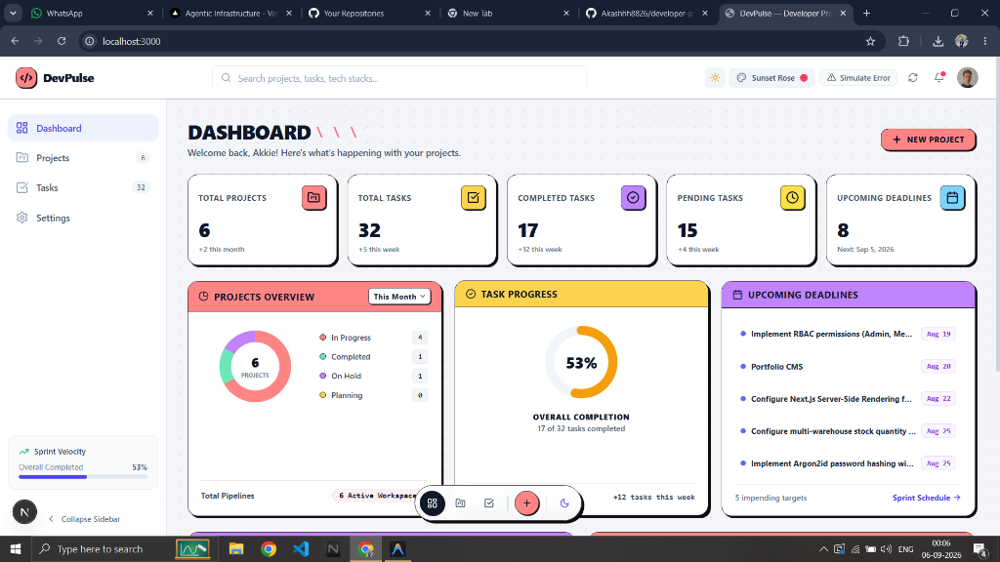
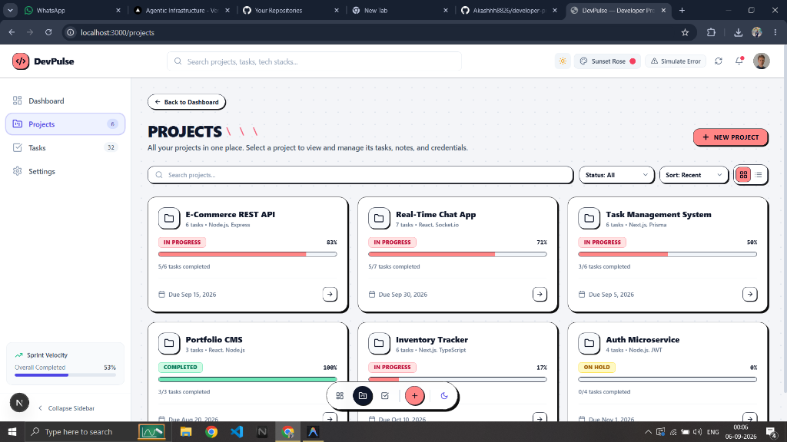
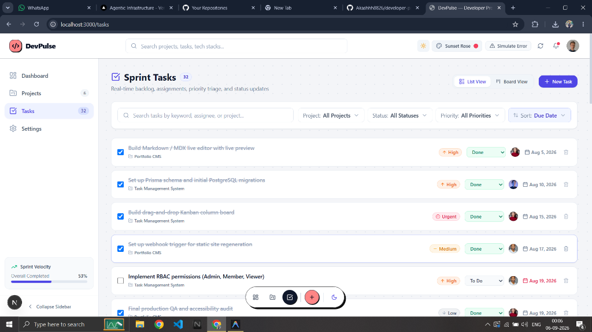

# DevPulse - Developer Productivity Dashboard

A modern, responsive web application built with Next.js, TypeScript, and Tailwind CSS to track developer productivity, manage projects, and organize sprint tasks.

## 🔗 Live Demo
- **Live Website:** [https://developer-productivity-dashboard.vercel.app](https://developer-productivity-dashboard.vercel.app)
- **GitHub Repository:** [https://github.com/Akashhh8826/developer-productivity-dashboard](https://github.com/Akashhh8826/developer-productivity-dashboard)

---

## 📸 Screenshots

### 1. Dashboard Overview


### 2. Projects Page


### 3. Sprint Tasks Page


---

## ✨ Features

- **Dashboard:** Overview of total projects, tasks, completed tasks, pending tasks, and upcoming deadlines with progress charts.
- **Projects Management:** View all ongoing projects, progress bars, and tech stack details.
- **Task Tracker:** Filter tasks by status, priority, and project, with interactive checkboxes to mark tasks as done.
- **Theme Support:** Clean Neo-brutalist UI design with multiple color themes.
- **Responsive Design:** Works smoothly on mobile, tablet, and desktop screens.

---

## 🛠️ Tech Stack

- **Frontend Framework:** Next.js 15 (App Router)
- **Language:** TypeScript
- **Styling:** Tailwind CSS
- **Icons:** Lucide React
- **Deployment:** Vercel

---

## 🚀 How to Run Locally

1. **Clone the repository:**
   ```bash
   git clone https://github.com/Akashhh8826/developer-productivity-dashboard.git
   ```

2. **Navigate into the project folder:**
   ```bash
   cd developer-productivity-dashboard
   ```

3. **Install dependencies:**
   ```bash
   npm install
   ```

4. **Start the development server:**
   ```bash
   npm run dev
   ```

5. **Open in browser:**
   Open [http://localhost:3000](http://localhost:3000) to see the dashboard.

---

## 👤 Author
- **Akash** - [GitHub Profile](https://github.com/Akashhh8826)
